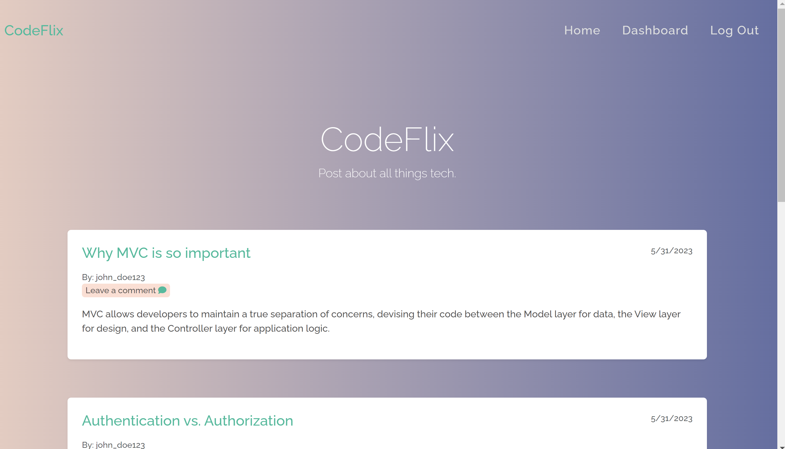
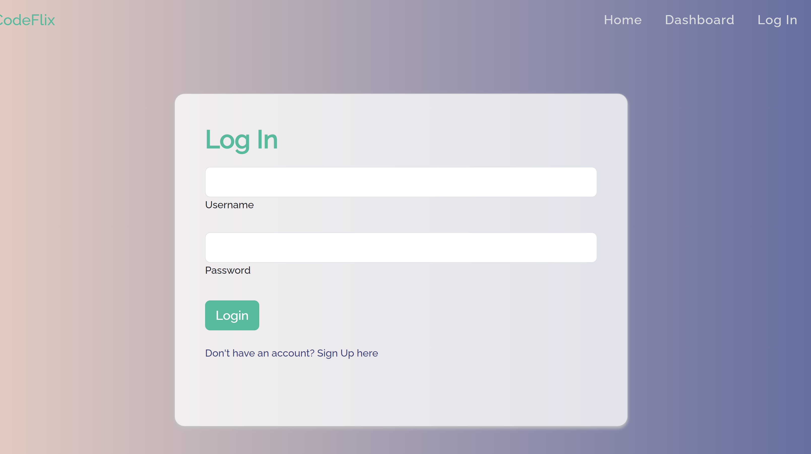
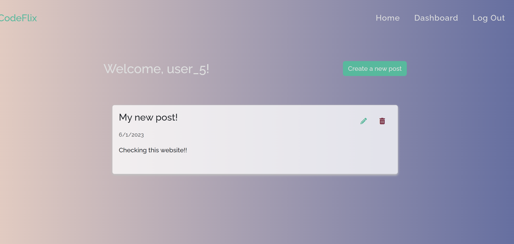

# MVC-TechBlog

  

  ## Description
  This app is a CMS style blog site. Users are able to create an account with a username and password. Once the user has an account they can add, update, and delete new blog posts that will be added to the homepage and leave comments for other blog posts. Users with a created account have their own dashboard to see their previous blog posts they have created.

  ## Table of Contents
  * [Installation](#installation)
  * [Usage](#usage)
  * [Credits](#credits)
  * [License](#license)
  * [How to Contribute](#how-to-contribute)
  * [Tests](#tests)
  * [Questions](#questions)
  
  ## Installation
  N/A

  ## Usage
  The user will need to create an account to create, update, and delete blog posts. Additionally they need an account to add comments to other user blog posts. To create an account, click on "login" and a sign up link will be available for new users. Once a new account is created, the user is directed to their own dashboard where any previous blog posts will be presented or a button to create a new blog post. Previous blog posts have icons to update or delete icons. On the homepage, users can click on the blog post title to see comments and have the option to leave a comment.

  Repo: https://github.com/cjsolis12/mvc-TechBlog.git 
  Deployed app: https://salty-reaches-15784.herokuapp.com/

  ## Credits

  - Gradient css background : https://cssgradient.io/    
  - https://getbootstrap.com/docs   
  - https://fontawesome.com/
  - https://mdbootstrap.com/docs 
  TA Gunner   

  ## License
    This app is licensed under the MIT license.

  ## How to Contribute
  N/A

  ## Tests
  N/A

  ## Questions
  Questions about this app?  
  GitHub: https://github.com/cjsolis12  

